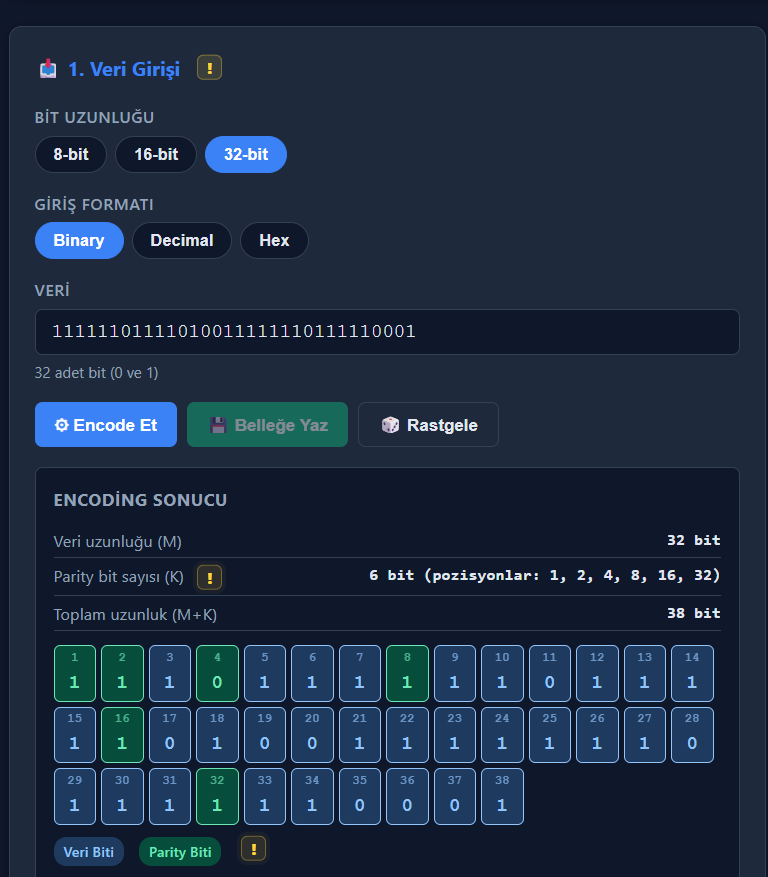
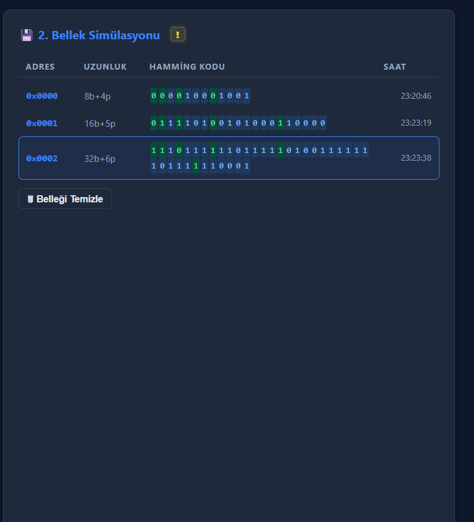
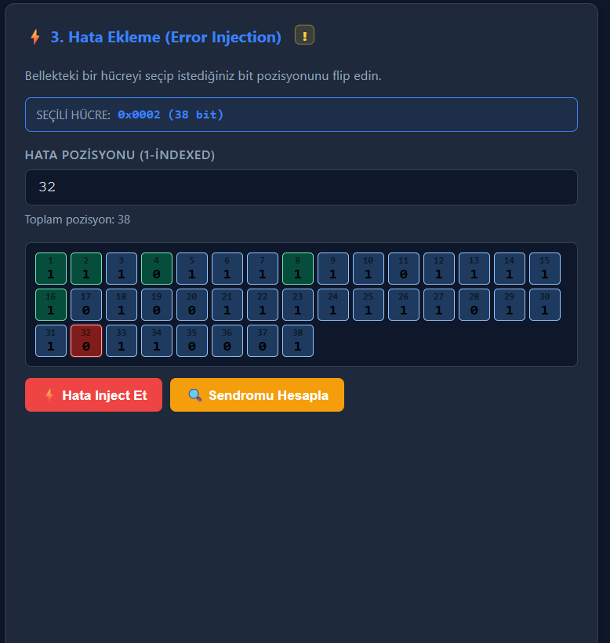
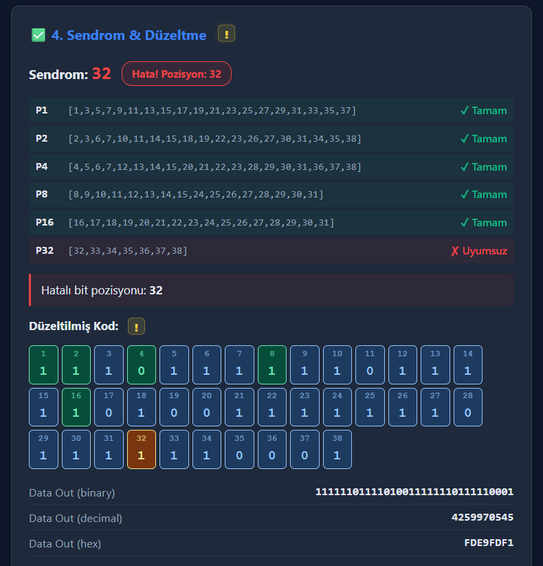
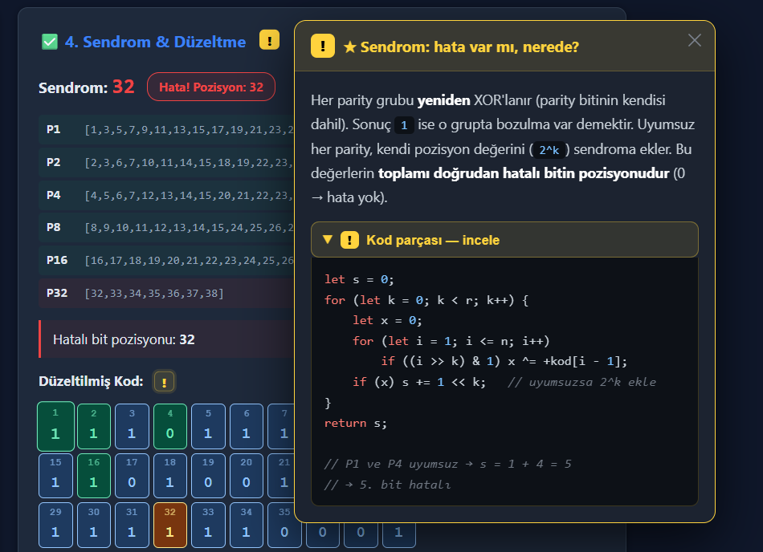
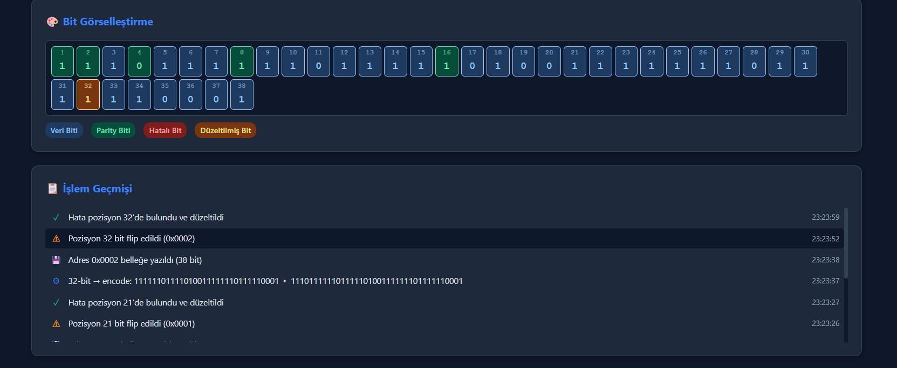

# Hamming Error-Correcting Code Simülatörü — SEC (Single Error Correction)

**BLM230 Bilgisayar Mimarisi — Dönem Projesi**
Bursa Teknik Üniversitesi

| | |
|---|---|
| **Ad Soyad** | Reşit Asrav |
| **Öğrenci No** | 23360859080 |
| **Ders** | BLM230 — Bilgisayar Mimarisi |
| **Demo Videosu** | ▶ [YouTube — Hamming Code Simülatörü Anlatımı](https://www.youtube.com/watch?v=OLugTSFcABc) |

---

## 🎬 Demo Videosu

Simülatörün çalışma mantığını ve arayüzünü anlattığım demo videosu:

**https://www.youtube.com/watch?v=OLugTSFcABc**

---

## 📌 Proje Tanımı

Bu proje, **8, 16 ve 32 bit** uzunluğundaki veriler üzerinde **Hamming SEC** (Single Error
Correction) kodunu uygulayan web tabanlı bir simülatördür. İstenen davranışlar:

- 8, 16 ve 32 bit uzunluğundaki veriler üzerinde Hamming Code fonksiyonu uygulanarak veriler **bellekte saklanabilir**.
- Belleğe yazılacak herhangi bir veri için **Hamming kodunun ne olacağını hesaplayıp** kullanıcıya yansıtır.
- Bellekten okunan verilerde herhangi bir bit üzerinde **(yapay olarak) hata oluşturmaya** izin verir.
  - Yapay olarak oluşturulan bu hatayı, karşılaştırma sonucunda ortaya çıkan **sendrom** kelimesinden yorumlayıp, başta yapay olarak oluşturulan hatalı biti **teyit eder**.
- Görsel öğeler kullanılarak olabildiğince **kullanıcı dostu** bir simülasyon arayüzü tasarlanmıştır.

---

## 🖼️ Ekran Görüntüleri

### 1. Veri Girişi, Encode ve Parity Bitlerinin Hesaplanması
8 / 16 / 32 bit veri girilir (binary, decimal veya hex); parity bitleri otomatik hesaplanıp gösterilir.



### 2. Belleğe Yazma
Encode edilen Hamming kodu adres, uzunluk ve saat bilgisiyle bellekte saklanır.



### 3. Hata Ekleme (Error Injection)
Bellekteki bir hücre seçilip istenen bit pozisyonu yapay olarak bozulur (flip).



### 4. Sendrom Hesaplama ve Düzeltme
Parity grupları yeniden kontrol edilir; sendrom hatalı bitin pozisyonunu verir ve bit düzeltilir.



### 5. Kod Yardımı — "Kod Üzerinden Anlatım" Kartı
Her bölümdeki sarı **!** rozetine tıklanınca, o adımın kod karşılığı açıklanır.



### 6. Bit Görselleştirme ve İşlem Geçmişi
Tüm bitler renk koduyla gösterilir; her işlem zaman damgasıyla loglanır.



---

## 📂 Dosya Yapısı

```
BLM230-PROJE-hammingCode/
├── index.html              ← Ana simülatör sayfası
├── test.html               ← Otomatik test senaryoları (15 test)
├── README.md               ← Bu dosya
│
├── css/
│   └── styles.css          ← Responsive tasarım (açık + koyu tema)
│
├── js/
│   ├── hamming.js          ← Hamming Code temel matematik (encode / sendrom / düzelt)
│   ├── hamming-cekirdek.js ← Sade çekirdek algoritma (asıl iş — ~90 satır)
│   ├── simulator.js        ← Bellek simülasyonu ve durum yönetimi
│   ├── ui.js               ← Arayüz, animasyon ve olay kontrolü
│   └── kod-yardim.js       ← Bölüm içi "!" açıklama kartları
│
├── screenshots/            ← Arayüz ekran görüntüleri
│   ├── 1-veri-girisi.png
│   ├── 2-bellek.png
│   ├── 3-hata-ekleme.png
│   ├── 4-sendrom-duzeltme.png
│   ├── 5-kod-yardimi.png
│   └── 6-gorsellestirme-log.png
│
└── video/
    └── HammingCode1.mp4     ← Demo videosunun yerel kaydı
```

> **Not:** Algoritmanın asıl mantığı `js/hamming-cekirdek.js` dosyasındadır (yalnızca ~90 satır:
> `encode`, `sendrom`, `duzelt`). Geri kalan dosyalar bu çekirdeği görsel olarak sunan arayüz katmanıdır.

---

## 🧮 Hamming Code Matematiği

### Parity Bit Sayısı
Veri uzunluğu `m` için `r` parity biti gerekir:

```
2^r ≥ m + r + 1
```

| Veri (M) | Parity (K) | Toplam (M+K) |
|----------|-----------|--------------|
| 8 bit    | 4 bit     | 12 bit       |
| 16 bit   | 5 bit     | 21 bit       |
| 32 bit   | 6 bit     | 38 bit       |

### Parity Bit Pozisyonları
Parity bitleri 2'nin kuvveti olan pozisyonlara yerleştirilir: **1, 2, 4, 8, 16, 32...**
Veri bitleri geri kalan pozisyonlara yerleştirilir: 3, 5, 6, 7, 9, 10, 11, 12...

### Parity Hesaplama
`P_{2^k}` parity biti, ikilik gösteriminde `k`. biti `1` olan tüm pozisyonların XOR'udur:

```
P1 (pos 1) = XOR(pos 1,3,5,7,9,11,...)
P2 (pos 2) = XOR(pos 2,3,6,7,10,11,...)
P4 (pos 4) = XOR(pos 4,5,6,7,12,...)
P8 (pos 8) = XOR(pos 8,9,10,11,12,...)
```

### Sendrom Hesaplama
Her parity grubu yeniden hesaplanır. Uyumsuzluk olan parity pozisyonlarının toplamı **sendromu** verir:

```
Sendrom = 0           → Hata yok
Sendrom = N (N > 0)   → N. pozisyonda hata var
```

---

## ▶️ Kullanım Adımları

```
1.  Bit uzunluğunu seç (8 / 16 / 32)
2.  Veriyi gir (binary, decimal veya hex)
3.  "Encode Et" butonuna bas
4.  Parity bitleri hesaplanıp görüntülenir
5.  "Belleğe Yaz" ile veriyi belleğe kaydet
6.  Bellekteki hücreye tıklayarak seç
7.  "Hata Inject Et" ile bir biti boz
8.  "Sendromu Hesapla" ile hata tespiti yap
9.  Sistem hatalı biti bulur ve düzeltir
10. Düzeltilmiş veri "Data Out" olarak gösterilir
```

Her bölümün başlığındaki sarı **!** rozetine tıklayarak o adımın **kod karşılığını** da görebilirsiniz.

---

## ⚙️ Teknik Özellikler

- **Dil / Platform:** Vanilla HTML5 + CSS3 + JavaScript (sıfır bağımlılık, kurulum yok)
- **Renk Kodlaması:**
  - 🔵 Mavi → Veri bitleri
  - 🟢 Yeşil → Parity bitleri
  - 🔴 Kırmızı → Hatalı bit
  - 🟠 Turuncu → Düzeltilmiş bit
- **Responsive:** Masaüstü ve mobil uyumlu
- **Tema:** Açık / Koyu mod (localStorage'da saklanır)
- **Bellek Simülasyonu:** 8 hücreye kadar aynı anda saklama

---

## 🧪 Test Senaryoları

`test.html` sayfasında 15 önceden tanımlanmış test senaryosu bulunmaktadır:

| Test | Açıklama |
|------|----------|
| TC-01 | 8-bit, hata yok → sendrom 0 |
| TC-02 | 8-bit, pozisyon 3 hata → sendrom 3 |
| TC-03..05 | Parity bit hataları |
| TC-06..07 | Sınır değerleri (0x00, 0xFF) |
| TC-08..10 | 16-bit senaryolar |
| TC-11..13 | 32-bit senaryolar |
| TC-14..15 | Düzeltme doğruluk testleri |

---

## 🚀 Çalıştırma

Kuruluma veya sunucuya gerek yoktur. `index.html` dosyasını modern bir tarayıcıda açmanız yeterlidir:

```
Dosya Gezgini → BLM230-PROJE-hammingCode → index.html → Çift tıkla
```

---

## 📦 Teslim

Proje, aşağıdaki sistematik dosya adıyla teslim edilmektedir:

```
BLM230_Proje_ResitAsrav_23360859080.rar
```

İçerik: tüm kaynak kodları + ekran görüntüleri + demo videosu YouTube linki (README içinde).

---

## 📚 Referans

- Patterson & Hennessy, *Computer Organization and Design*, Bölüm 5
- R. W. Hamming, "Error Detecting and Error Correcting Codes", *Bell System Technical Journal*, 1950
